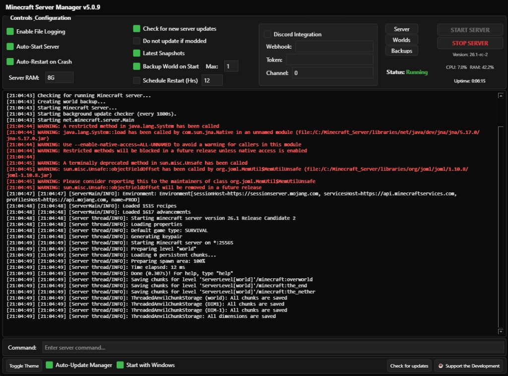

# Minecraft Server Manager

A Python-based server management tool for dedicated Minecraft instances. Provides automated updates, backups, crash recovery, and remote control via a modern PySide6 GUI or headless console mode.

[](CHANGELOG.md)
[](https://www.python.org/)
[]()

## Screenshot



*Graphical interface showing controls, real-time console output, resource monitoring (CPU/RAM), and server command input.*

---

## Features

| Feature | Description |
| :--- | :--- |
| **Dual interfaces** | PySide6 GUI or headless console mode (`-nogui`) |
| **Automated updates** | Mojang manifest API; downloads JAR and restarts when updates are available |
| **Single-instance lock** | Prevents multiple manager instances from controlling the same server |
| **Crash detection** | Monitors process health and performs automatic restarts |
| **Scheduled restarts** | Configurable intervals for clean reboots |
| **World backups** | Archives the world directory to zip before startup; configurable retention |
| **Discord integration** | Webhooks and bot (`!start`, `!stop`, `!restart`, `!status`) |
| **Modded support** | Compatible with Forge and NeoForge; optional update suppression when mods are present |
| **Linux integration** | `-install-service` (systemd) and `-enable-autostart` (desktop) |
| **Self-update** | Manager checks GitHub for updates; footer "Check for updates" button triggers manager check (not server JAR) |

---

## Requirements

| Requirement | Details |
| :--- | :--- |
| **OS** | Windows, Linux, or macOS |
| **Java** | Java 17 or Java 21 (depends on Minecraft version) |
| **Python** | 3.8+ |
| **Dependencies** | `psutil`, `PySide6`, `discord.py` (optional) |

```bash
pip install -r requirements.txt
```

---

## Installation

1. Clone or download the repository.
2. Place `mcsm.pyw` in the root directory of your Minecraft server.
3. Install dependencies (see above).
4. Run: `python mcsm.pyw`

---

## Usage

### Graphical mode

```bash
python mcsm.pyw
```

- Real-time console output
- One-click start/stop
- Inline configuration (backups, Discord, RAM, etc.)
- Shortcuts to Server, Worlds, and Backups folders
- Light/dark theme toggle

### Headless mode

```bash
python mcsm.pyw -nogui
```

Reads settings from `mcsm.conf`. Suitable for servers without a display.

### Command-line options

| Option | Description |
| :--- | :--- |
| `-nogui` | Run in console-only mode |
| `-install-service` | (Linux) Install systemd service. Requires `sudo` |
| `-enable-autostart` | (Linux) Add to desktop auto-start |
| `-help` | Show help and exit |

---

## Configuration

Settings are stored in `mcsm.conf` (created on first run).

| Option | Description |
| :--- | :--- |
| `server_memory` | Heap size (e.g., `4G`, `8G`) |
| `check_updates` | Check for Minecraft updates on startup |
| `update_to_snapshot` | Use latest snapshot instead of release |
| `modded_do_not_update` | Skip vanilla updates when mods are detected |
| `enable_backups` | Create world backup before start |
| `max_backups` | Number of backups to retain |
| `enable_auto_restart` | Restart on crash |
| `enable_schedule` | Enable scheduled restarts |
| `restart_interval` | Hours between scheduled restarts |
| `enable_discord` | Discord webhook/bot notifications |
| `manager_auto_update` | Background check for manager updates from GitHub |

> **Discord bot:** Enable **Message Content Intent** in the Discord Developer Portal for chat commands.

---

## Changelog

See [CHANGELOG.md](CHANGELOG.md) for version history.

---

*Developed and maintained by **UnDadFeated***
